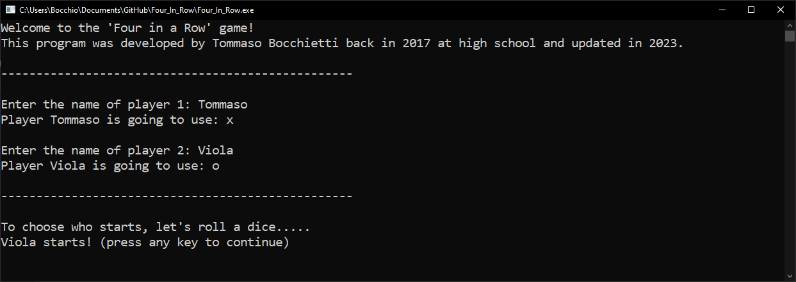
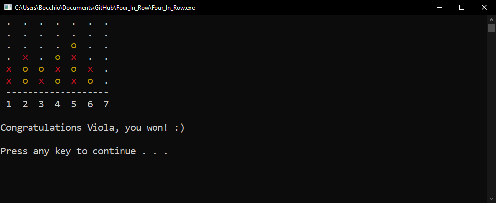

# Connect_4_Game

This is a **simple implementation of the Connect 4 Game game, developed during high school using basic concepts of C**.




## How to play

The game is a two player game, where each player has to connect four pieces of the same color in a row, column or diagonal.

At first, you will be prompted to insert the players' names, and each player will be assigned a symbol (X or O).

For each turn the play board will be displayed, and the player will be prompted to insert the column where he wants to place his piece.

The game will end when one of the players connects four pieces in a row, column or diagonal, or when the board is full.

## How to compile

To compile the game, you need to have the GCC compiler installed on your machine.

To compile the game, simply run the following command:

```shell
gcc utils.c Main.c -o Connect_4_Game.exe -std=c99
```

## How to run

To run the game, simply run the following command:

```shell
./Connect_4_Game
```

## Improvements / pull requests

Some things that could be improved are:
- [ ] Graphics;
- [ ] Menu to restart/quit the game;
- [ ] Online multiplayer support (at least LAN);
- [ ] Any other improvement you can think of.

Since this repo is still at a very basic level of implementation and complexity, **I would love to see improvements!**
Feel free to fork this repository, make pull requests or do whatever you want with it.


Have a nice coding day,

Tommaso :panda_face:


