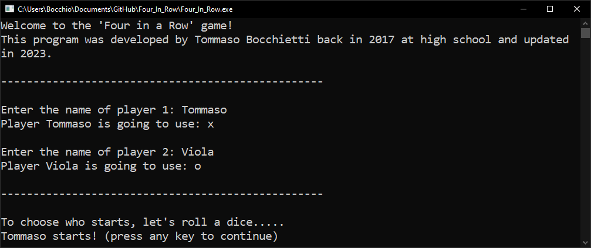

# Connect_4_Game

This is **a (not so basic) 'Connect 4 Game' implementation**, developed during high school using basic concepts of C and then improved during my free time.




## How to play

The game is a two player game, where each player has to connect four pieces of the same color in a row, column or diagonal.

At first, you will be prompted to insert the players' names, and each player will be assigned a symbol (X or O).

For each turn the play board will be displayed, and the player will be prompted to insert the column where he wants to place his piece.

The game will end when one of the players connects four pieces in a row, column or diagonal, or when the board is full.

## How to compile

You need to have the GCC compiler installed on your machine and a copy of the <getopt.h> header file.

To compile the game, simply run the following command:

```shell
gcc Main.c board.c setup.c utils.c -o Connect_4_Game.exe
```

## How to run

To run the game, simply run the following command:

```shell
./Connect_4_Game
```

### Options / Personalizations

The game has some options that can be used to personalize the game.

 - `-h` or `--help`: To show the help message and exit.
 - `-b` or `--board`: To set a different board size in the format 'rows x columns'.
 - `-p` or `--player`: To set the number of players.
 - `-w` or `--winning`: To set the number of symbols to win.

Here is an example of how to use the options set to the deafult values:

```shell
./Connect_4_Game -b 6x7 -p 2 -w 4
```

## Improvements / pull requests

Some things that could be improved are:
- [ ] Graphics;
- [ ] Menu to restart/quit the game;
- [ ] Online multiplayer support (at least LAN);
- [ ] Any other improvement you can think of.

Since this repo is still at a very basic level of implementation and complexity, **I would love to see improvements!**
Feel free to fork this repository, make pull requests or do whatever you want with it.

Have a nice coding day,

Tommaso :panda_face:


